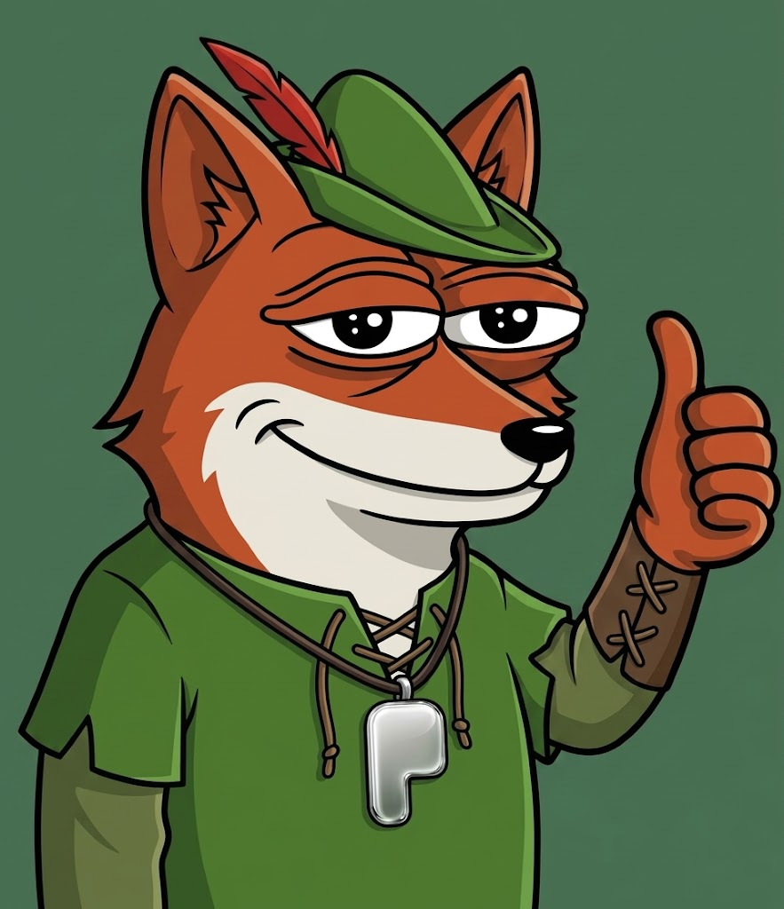

# ROPONS
### The Fox Who Never Took, Only Redistributed
**A Brand Narrative and Technical Launch Reference for the Pons Family V2 Mascot**

---
 

*Ropons, the fox dressed as Robin Hood, canonical mascot of Pons Family. Read this document alongside the image above, since every narrative and technical decision below is written to justify and extend what's shown in it.*
 
---

## Who Ropons Is, in Short

Ropons is a fox dressed as Robin Hood, the canonical mascot of Pons Family. He was once the fastest hand in the old markets, able to move value between people before anyone noticed it had changed hands. What set him apart was never the speed, but the direction of the giving: everything he took from the walled, custodial counting houses of the old guard, he gave back, split openly among everyone who showed up.

That's his why. Pons Family is a protocol that never holds a user's funds, that returns fees to creators, buys back its own token, and burns supply instead of hoarding it. Ropons exists because that behavior needed a face. He doesn't take. He redistributes. He's also not a static logo. He's the character who walks people through the platform itself, including the technical documentation on GitHub, where he appears at each stage of the developer walkthrough.

The rest of this document tells his story in full, explains the protocol behind it, and walks through how the team built and launched him.

---

## Part I — The World of Ropons

### Origin

Ropons wasn't born a hero. By his own account, he was simply the fastest hand in the old markets, able to move value between people before anyone noticed it had changed hands at all. What set him apart from every other trickster in the forest wasn't the speed of the hand, but the direction of the giving. Everything he took from the walled counting houses of the old guard, he returned, divided transparently among everyone who'd shown up, in a way no one could ever quietly claw back.

### The Forest as Protocol

In Ropons' world, the forest isn't scenery, it's the chain itself. Every path through the trees is a bonding curve: narrow at the entrance, widening as more travelers commit to the route, opening finally into what Ropons calls the Clearing, his word for graduation, the moment a path becomes a permanent, protected meeting ground that no single traveler can wall off again.

The old counting houses, walled, custodial, permissioned, are his antagonists not because they're evil, but because they're slow and closed. The whole mythology runs on that contrast: open against walled, fast against gatekept, shared against hoarded.

### The Quiver

Ropons carries a quiver that's never full and never empty, because arrows return to it. This is the protocol's fee cycle made literal. Every transaction across the forest sends a share of value back to the quiver, and from there, back out to the trees themselves, which is Ropons' version of the burn. He doesn't stockpile. This image, the quiver constantly emptying and refilling, does the heaviest work in the whole character: it turns a mechanism nobody can see into a gesture anyone can read at a glance.

### Voice and Temperament

Ropons isn't a jester. He's warm, dry witted, quietly confident, and allergic to his own importance. He doesn't brag about outsmarting the old guard, he just keeps doing it in plain sight, because the forest's rules no longer let anyone stop him. In copy and in his social voice, that means understated confidence, a wink rather than a shout, and jokes aimed at the walls, never at the audience.

---

## Part II — The Foundation: Pons Family V2

A mascot built without understanding the product becomes a plush toy. Before any artwork was made, the team needed a working model of the mechanics Ropons would come to represent, and the story above is a direct translation of what follows.

### What Pons Family Is

Pons Family is a launchpad built on Robinhood Chain. Anyone can deploy a fixed supply token in minutes, no code required. A newly launched token doesn't drop straight into an open market. It first trades on a bonding curve, a pricing mechanism where the price rises as more people buy in, until the token reaches a graduation target. At that point its liquidity locks permanently and moves into a Uniswap V4 pool.

Two principles shape everything else about the product, and by extension the brand:

- **Non custodial by design.** The platform never holds user funds. Every launch and every trade is a wallet approved transaction, signed and executed by the user, not on their behalf.
- **Fixed supply, visible rules.** Nothing gets minted after deployment. What exists at launch is what exists forever.

### What Changed in V2

V2 moved Pons from a single track memecoin factory into a broader launch environment:

- **ETH based bonding curve.** Tokens are priced and traded against ETH rather than a proprietary in-house pair, making pricing easier to read and liquidity easier to bootstrap.
- **Uniswap V4 integration at graduation.** Once a token clears its threshold, its liquidity moves directly into V4 infrastructure instead of a closed, proprietary pool.
- **Expanded trading pairs, including tokenized stocks.** Beyond ETH and stablecoins, V2 approved tokenized equities as launch pairs, positioning Pons at the meeting point of meme culture and real world asset tokenization.
- **Creator aligned economics.** Creators are paid in whatever pair their token launched against. A share of launch fees funds protocol buybacks of PONS, and transaction fees are burned, permanently reducing supply.

### Contract Level Mechanics

At a functional level, a Pons V2 token deployment behaves roughly like this:

- `createToken(name, symbol, pair, metadataURI)` deploys a new fixed supply ERC-20 alongside a bonding curve contract, with the creator choosing the settlement pair, ETH, an approved stablecoin, or an approved tokenized stock, at creation time.
- `buy(amount, minTokensOut)` and `sell(amount, minPairOut)` execute directly against the curve. Price moves algorithmically with each trade; there's no order book and no external market maker.
- A `graduationThreshold` is set per pair at deployment. Once cumulative volume or reserve value on the curve crosses it, the contract becomes eligible to graduate.
- `graduate()` is permissionless and callable by anyone once the threshold is met. It migrates the accumulated liquidity from the bonding curve into a new Uniswap V4 pool, locks the LP position at the protocol level, and disables further curve trading for that token.
- A protocol fee is skimmed on every buy and sell, and splits three ways: a portion routes to the creator in the launch pair, a portion funds a scheduled PONS buyback, and a portion is burned outright by sending PONS to a dead address, which is what has already removed a meaningful share of total PONS supply from circulation.

### Selecting a Stock as a Launch Pair

The tokenized stock option in V2 isn't open ended. A creator can only pair a new launch against a stock that already exists on an approved allowlist of tokenized equities available on Robinhood Chain. In practice:

1. The creator picks a pair from a maintained list of supported tokenized stocks at the `createToken` step, rather than supplying an arbitrary address.
2. The bonding curve for that launch is denominated in the chosen stock token, so price discovery and graduation thresholds are expressed in units of that stock rather than in ETH.
3. On graduation, liquidity migrates into a Uniswap V4 pool paired against that same stock, so the trading pair chosen at minute one persists all the way through to the token's permanent market.

This is the mechanic that quietly connects meme culture to real world assets: a token can be born, priced, and eventually locked into a market denominated entirely in a tokenized share of a public company, without anyone ever leaving the Pons interface.

None of this is inherently visual. Bonding curves, graduation thresholds, fee splits and burns are contract logic, not imagery. Users don't feel a smart contract execute, they feel a character who behaves the way that contract behaves. Closing that gap is the job the design decisions below were meant to do.

---

## Part III — Why a Fox, Why Robin Hood

Every visual choice in Ropons encodes a specific mechanic from Part II, using the world built in Part I.

| Protocol Mechanic | Ropons Trait | The Translation |
|---|---|---|
| Non custodial, wallet signed transactions | An outlaw who acts with the crowd, never on their behalf | Robin Hood never held the gold himself, he moved it. Ropons never touches a wallet directly; he opens the path and steps aside. |
| Fixed supply, no post launch minting | A precise, single shot archer, never a hoarder | One arrow, one shot, nothing wasted. A fox reads as clever and efficient, never greedy. |
| Fee split into buyback and burn | The Quiver, arrows taken and sent back out | The redistribution at the heart of the Robin Hood myth maps directly onto a mechanism that returns value to holders and removes supply from circulation. |
| Bonding curve and graduation | The forest path leading to the Clearing | Robin Hood's world runs on routes, hideouts and thresholds, which mirrors a token's path from curve to graduation closely. |
| Permissionless deployment and stock pairing | An outlaw operating outside the walled establishment | The fox as outlaw archetype already carries centuries of "the little guy outsmarting the system," so no education is required. The story already lives in the audience's head. |

### Why a fox, specifically, and not a wolf, a rabbit, or a human outlaw

A fox reads as clever rather than threatening. A wolf implies danger, which the brand wanted nowhere near a category already associated with recklessness. A fox's silhouette, narrow, low, quick, communicates speed and precision, echoing "deploy a token in minutes." The fox plus Robin Hood combination was also largely unclaimed ground. A human Robin Hood figure risks being confused with the underlying chain itself, since the product sits on Robinhood Chain. Giving the mascot an animal form, an unusual palette, and a forest setting keeps him clearly Pons' own character rather than an unofficial mascot for the chain he runs on.

---

## Part IV — Step by Step: Constructing the Launch

**1. Anchor the character to one mechanical truth.** Before naming or drawing anything, the team wrote a single brief line: Ropons has to read as "gives back to the many" at a glance, with zero copy required. Every later decision was tested against that sentence, and anything that didn't reinforce it was cut.

**2. Build the visual system before the story.** Silhouette, palette and posture were locked first: a lean fox form, a forest green hood, a bow held loosely rather than drawn so he reads as approachable rather than aggressive, and muted earth tones to avoid the neon crypto mascot look. Only once the silhouette worked at thumbnail size, the size it would actually be seen at on a token icon or a social avatar, did the team move on to backstory.

**3. Write the lore after the mechanics, not before.** The origin story, the forest as protocol metaphor, and the quiver device were all written by reverse engineering the V2 contract logic into folklore. That order mattered. It kept the myth honest to the product instead of producing a cute character that mechanics had to be bolted onto afterward.

**4. Stress test against the naming collision.** Because the underlying chain is literally called Robinhood Chain, the team had to actively design against Ropons being mistaken for an official mascot of the chain itself. The fox form, the forest setting, and the deliberately old world outlaw framing, rather than a modern fintech look, all helped draw a clear line between Pons' mascot and Robinhood's.

**5. Design for motion, not just a static portrait.** Since a launchpad's core action is deployment, fast and repeatable, Ropons was designed from day one with a signature "nock and release" motion in mind, meant for loading states, transaction confirmation animations, and short social clips. A mascot for a fast product has to feel fast itself.

**6. Lock the recurring visual devices.** The Quiver, standing for the buyback and burn cycle, the Clearing, standing for graduation, and a Hood Down and Hood Up state change, used to signal open and permissionless versus in motion and guarded, became permanent, reusable assets. Together they give the brand a simple visual grammar that scales across campaigns.

**7. Launch quietly and let the community write the myth.** Rather than a heavy unveiling with a long explainer thread, Ropons was introduced through small, self contained moments: a single arrow loosed in animation, a teaser of a forest path. The gaps were left on purpose, and the community's own captions and fan art did more narrative work in the first week than any official copy could have, reinforcing Ropons as found folklore rather than a manufactured mascot.

**8. Keep the mechanic and the myth moving together.** Every future protocol change is treated as a story beat, not just a changelog entry. A new trading pair becomes a new path through the forest. A fee adjustment becomes a change in how full the quiver runs. That discipline keeps Ropons growing with the product instead of sitting beside it as a fixed logo.

---

## Part V — Ropons on GitHub

Ropons isn't reserved for social media and marketing. He also accompanies the technical documentation itself. Across the GitHub repository, he appears at each stage of the developer walkthrough, from initial setup through to token graduation, as a consistent guide rather than a decorative header image.

Each major section of the README and docs, setup, `createToken`, curve mechanics, pair selection, graduation, fee routing, gets a small Ropons illustration matched to that step, using the same visual grammar established in Part IV: the bow at rest during setup, the arrow loosed at a trade, the Clearing at graduation, the Quiver beside the fee and burn explanation.

His tone in the docs stays consistent with his brand voice: plain, dry, a little wry, never hiding technical complexity behind jokes but never explaining it in a flat, faceless way either. The goal is continuity. A developer reading the contract reference and a trader scrolling social media should recognize the same character doing the same conceptual job, making an otherwise invisible mechanism legible at a glance.

---

## Closing Note

Ropons works because he wasn't designed to be liked first. He was designed to be legible first, and likability followed from that clarity, the way it usually does with the best mascots. He doesn't explain the bonding curve. He is the bonding curve, wearing a hood.

---

*Prepared as a brand narrative and technical launch reference for the Pons Family creative, community and developer relations teams.*
