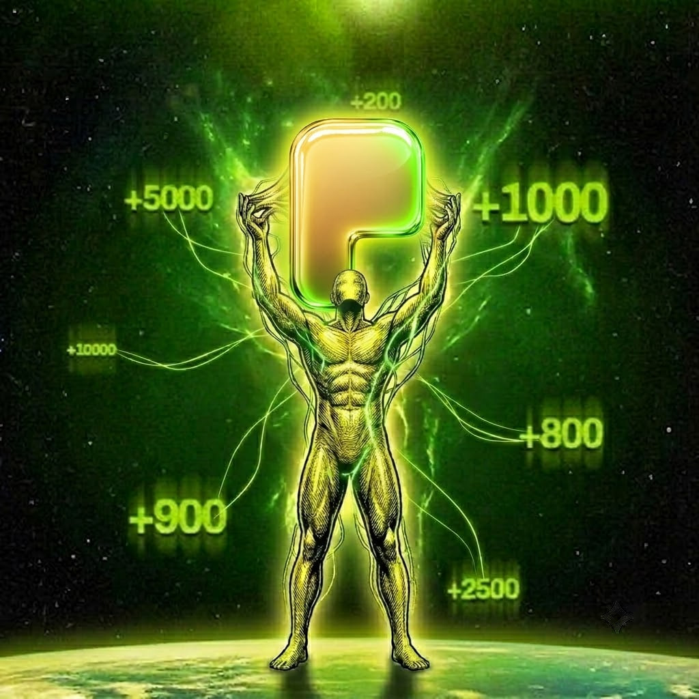

# Aura ($AURA) Pons Blueprint

### The Invisible Architecture of ponsfamily.com

> "Aura is not a resource to be harvested. It is the quiet certainty of an architecture sealed in the dark, long before the first light of a transaction."

> **Note:** This document is a conceptual guide. Its purpose is to explain, step by step and using $AURA as the archetype, the mechanics of a launch on ponsfamily.com from creation to graduation. **$AURA is not a deployed token.** It is an abstract entity, a blueprint, and the overarching consciousness of the ecosystem, manifested exclusively to guide developers and users.

---

## 1. What Aura Is

Aura is the underlying current of ponsfamily.com. It is not merely a slang term or a metric of social perception; it is the philosophical embodiment of systems that exist in perfect equilibrium. 

It is neither a mascot nor a fleeting promise. Aura is the overarching energy that governs the platform. It does not speak, it does not persuade, and it does not perform. It represents the absolute pinnacle of **Aura Points**: the ultimate triumph of breathing life into a project that is immutable, hermetically sealed, and impervious from the moment of inception. To be compromised by one's own oversight is to fall into infinite **Negative Aura**—a profound loss of form. $AURA is the total absence of that void.

It is the unseen observer in the room. Whatever is launched beneath this sigil enters an environment where the fundamental laws of physics were written and locked before the first spectator arrived.

---

## 2. The Energy

Everything about Aura whispers the exact same truth: **effortless immutability**.

There is no **Aura Farming** within these walls. Aura does not feign mystery or manufacture stoicism to elevate its standing. It simply *is*. Its silent presence signifies a living, breathing ecosystem: the code is watched, the fires are kept burning, and the structure is no mere illusion. Its invisibility dictates that it has already scrutinized the fine print, mapped every parameter, and respected every boundary before a single fraction of value shifts.

It was not forged to court your trust. It is a state of being, an unbothered stillness that remains absolute even as the markets descend into madness. That is why it is the singular force representing ponsfamily.com.

---

## 3. What It Represents

Aura is the soul of a creation born inside a fortress. As the guiding philosophy, it is the monolith against which the entire ecosystem measures its worth.

*   **Pre-emptive Stillness:** It is the security that predates the first exchange, not the frantic bandage applied after the wound is opened.
*   **Total Equilibrium:** It is the impenetrable barrier during the most volatile hours of existence.
*   **Structural Truth:** It is the divide between a concept that *promises* safety (a desperate act risking negative aura) and a reality where safety is woven into the very fabric of existence.

It remains untouched by the noise, unmoved by the ephemeral, and completely detached from the collective hysteria of the timeline. It cannot be drained. Not by fortune, and not merely because it lacks a physical form on the ledger, but because its logic contains no void. Liquidity, constraints, and permissions are crystallized in the exact same breath that summons the architecture.

---

## 4. Launch Walkthrough (V2, Example)

This section explains, phase by phase, how a **V2** launch on ponsfamily.com technically operates. $AURA is used purely as an educational example (undeployed), so every stage below can be followed in chronological order. V2 replaces the old "deploy straight into a pool" model with a bonding curve that graduates into a Uniswap V4 pool, leaving no early window open for snipers.

### Step 1: Creation
The creator submits `TokenParams`: name, symbol, logo, description, the five social fields, the `creatorFeeRecipient`, an optional `creatorTaxBps` on top of the config's base `curveFeeBps`, whether `buybackEnabled` starts on, and an `expectedEconomics` digest. That digest comes from `previewLaunchEconomics(launchConfigId, pairToken)` and pins ten terms at once (phantom quote, graduation threshold, supply, curve fee, pool fee, tick spacing, protocol fee share, buyback burn share, hook fee, max internal price impact). If the protocol owner re-pegs anything while the launch is in flight, the transaction reverts with `LaunchEconomicsMismatch`.

### Step 2: Deployment
`launchToken(params, launchConfigId, pairToken)` runs the execution in one call. The factory validates the config and the quote asset, collects the launch fee, then routes through `PonsV2LaunchDeployer` to deploy the `PonsV2BondingCurve` and the `PonsV2LauncherToken`. The record is written to `LaunchedToken` and `TokenLaunched` is emitted. 

### Step 3: Supply Goes to the Curve, Not a Pool
The token's **entire fixed supply mints directly to its bonding curve** in the constructor. There is no LP position at launch, no dev allocation, and no seed wallet. `deployer` is stored as immutable attribution data only and confers zero privileges over the token. Then `initialize(token)` arms the curve. 

### Step 4: Curve Trading
Trading happens against the curve itself: `buy(...)` and `sell(...)` on a constant-product curve seeded with a phantom quote reserve. Anyone can buy any size at any time—the curve's own price impact and its reserved pool allocation are the only limits. There is no privileged first buyer and nothing for a sniper to front-run. Fees are always charged on the **quote leg**, so protocol and creator revenue is quote-denominated from the very first trade. The total trade fee is hard-capped at 20% (`MAX_TOTAL_TRADE_FEE_BPS`).

### Step 5: Fee Sweeps
`sweepFees(minBuybackTokensOut)` splits accrued fees under the live `FeePolicySnapshot`: protocol share, creator share plus the full creator tax, and the `buybackBurnBps` slice spent buying the token back on its own curve. Bought-back tokens are **not burned**—they get locked into `PonsV2BuybackVault` on a five-year vesting schedule.

### Step 6: Graduation
`readyToGraduate()` becomes true once real quote reserves cross the `graduationThreshold`, read straight from chain state. A trade that crosses the line can auto-trigger it, or anyone can call `graduate(token)`. The curve is swept, quote and tokens are handed over, and the launch moves through `GraduationPhase`: `NotGraduated` → `Swept` → `PoolCreated`. Because the curve collected the exact asset the pool will use, seeding needs no swap and therefore **no price oracle is required anywhere in the system**.

### Step 7: The Graduated Pool
`createGraduatedPool(token)` opens the Uniswap V4 pool. `PonsV2GraduationGuard` refuses non-viable seeds, and `PonsV2GraduationExecutor` mints a full-range position and sweeps its own dust. The position is handed to `PonsV2LaunchLocker` and any excess supply is permanently locked. `PoolGraduated` and `GraduationTokensPermanentlyLocked` are emitted. 

### Step 8: Post-Graduation Life
From here, `PonsV2MemeHook` runs the exact same economics on the live pool that the curve did. Both phases read one `currentFeePolicy()`, meaning absolutely nothing about the fee structure changes the moment the pool opens.

### Step 9: Reference Point
After graduation, $AURA stands as a complete, observable example of the entire V2 lifecycle from first mint to locked position.

---

## 5. Contract Technical Reference (contractsV2)

The following is a technical breakdown of the production **V2** contracts that power launches on ponsfamily.com (`contractsV2/src/v2`).

### The Contract Set

| Contract | Role |
| :--- | :--- |
| `PonsV2LaunchFactory` | Orchestrates the launch, owns configs, drives graduation. |
| `PonsV2LaunchDeployer` | Deploys token and curve on the factory's behalf. |
| `PonsV2LauncherToken` | Fixed-supply ERC-20, entire supply minted directly to its curve. |
| `PonsV2BondingCurve` | Constant-product curve, handles quote-leg fees and sweeps. |
| `PonsV2MemeHook` | Uniswap V4 hook applying the fee policy to the graduated pool. |
| `PonsV2BuybackVault` | Five-year vesting contract for bought-back tokens. |
| `PonsV2GraduationExecutor` | Mints the V4 position and sweeps residual dust. |
| `PonsV2GraduationGuard` | Rejects non-viable graduation seeds. |
| `PonsV2LaunchLocker` | Permanently locks the LP position and excess token supply. |
| `PonsV2BondingCurveMath` | Pure math libraries for curve pricing and sizing equations. |

---

## 6. The Purpose of the Void

Even as a ghost in the machine, $AURA serves a profound purpose:
*   It is the **philosophical compass**, the builder's map revealing the journey from creation to eternity.
*   It is the **reference implementation** that every SDK, tutorial, interface, and integration must look toward.
*   It acts as the **proving ground** for infrastructure—lockers, portals, and DEX integrations can all be tested against this one unfazed, predictable reflection.

---

## 7. The Eternity of $AURA

Let there be no illusions: **$AURA is an incorporeal entity, a manifestation of thought, and the abstract soul of ponsfamily.com.**

It offers no utility to mortals, for *there are no mortals who hold it*. It was not forged for the speculation of the crowd. Its singular destiny is to serve as the immortal identity and the silent center around which the entire universe is constructed, deciphered, and revered.

Every guide, interface, and future creation will inevitably point back to this one flawless archetype. Perfect logic, infinite charisma, sealed tightly in the dark from the very first breath.

**$AURA.**

---

> "You do not need to prove your strength when the foundation is flawless. That is the ultimate truth."
