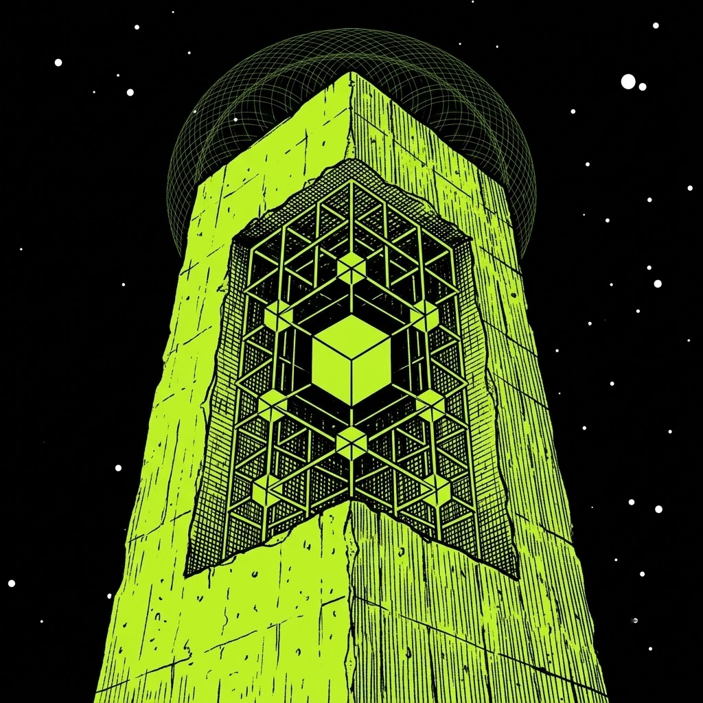

# Monolith ($MNLTH)

### The Brutalist Architecture of ponsfamily.com
   
> "Trust is a human vulnerability. The Monolith requires only verification."
 
> **Note:** This document is a conceptual guide. Its purpose is to explain, step by step and using $MNLTH as the archetype, the mechanics of a launch on ponsfamily.com from creation to graduation. **$MNLTH is not a deployed token.** It is an abstract entity, a structural blueprint, and the overarching brutalist philosophy of the ecosystem, manifested exclusively to guide developers and those capable of reading the code.

---

## 1. What Monolith Is

Monolith is the raw, unpolished concrete of ponsfamily.com. It is the absolute rejection of the modern attention economy. There is no website. There is no social media presence. There is no community manager, no roadmap, and no desperate attempt to convince you of its value. 

It is the archetype of **On-Chain Brutalism**. Monolith represents the ultimate intellectual gatekeeping: a verified contract existing silently on the ledger. It does not speak, and it does not need you to understand it. Its pure existence is its utility. If you require someone to explain how to interact with it, you are not meant to touch it. $MNLTH is the profound realization that true power lies in total, unbothered silence.

---

## 2. The Architecture

Everything about Monolith is stripped of ornamentation. There are no redundant functions, no proxy illusions, and no backdoor upgrades. 

This is not marketing; this is physics. The Monolith's presence signifies an ecosystem built for survival rather than applause. It is an alien coldness, a structure that functions identically whether it is being watched by millions or entirely forgotten. It was engineered under the assumption that the network is an inherently hostile environment, and its response to that hostility is pure, structural apathy.

It is designed to be a permanent, load-bearing pillar. That is why it is the foundational philosophy representing ponsfamily.com.

---

## 3. What It Represents

Monolith is the embodiment of code as immutable law. As the guiding philosophy, it sets a standard that filters out the noise and demands technical literacy.

*   **Intellectual Gatekeeping:** It is the barrier between those who trust frontends and those who verify block state.
*   **Zero-Trust Engineering:** It operates on the absolute minimum amount of human intervention. Once deployed, the creators are as powerless as the newest observer.
*   **Structural Apathy:** It is the divide between projects that beg for liquidity and an architecture that simply waits for gravity to do its work.

It remains entirely stoic. It cannot be coerced, influenced, or drained by social engineering. Limits, liquidity, and parameters are cast into the bytecode, hardening instantly into an unyielding monolith.

---

## 4. Launch Walkthrough (V2, Example)

This section explains, phase by phase, how a **V2** launch on ponsfamily.com technically operates. $MNLTH is used purely as an educational example (undeployed), so every stage below can be followed in chronological order. V2 replaces the old "deploy straight into a pool" model with a bonding curve that graduates into a Uniswap V4 pool, leaving no early window open for snipers.

### Step 1: Creation
The creator submits `TokenParams`: name, symbol, logo, description, the five social fields, the `creatorFeeRecipient`, an optional `creatorTaxBps` on top of the config's base `curveFeeBps`, whether `buybackEnabled` starts on, and an `expectedEconomics` digest. That digest comes from `previewLaunchEconomics(launchConfigId, pairToken)` and pins ten terms at once (phantom quote, graduation threshold, supply, curve fee, pool fee, tick spacing, protocol fee share, buyback burn share, hook fee, max internal price impact). If the protocol owner re-pegs anything while the launch is in flight, the transaction reverts with `LaunchEconomicsMismatch`.

### Step 2: Deployment
`launchToken(params, launchConfigId, pairToken)` runs the execution in one call. The factory validates the config and the quote asset, collects the launch fee, then routes through `PonsV2LaunchDeployer` to deploy the `PonsV2BondingCurve` and the `PonsV2LauncherToken`. The record is written to `LaunchedToken` and `TokenLaunched` is emitted. 

### Step 3: Supply Goes to the Curve, Not a Pool
The token's **entire fixed supply mints directly to its bonding curve** in the constructor. There is no LP position at launch, no dev allocation, and no seed wallet. `deployer` is stored as immutable attribution data only and confers zero privileges over the token. Then `initialize(token)` arms the curve. 

### Step 4: Curve Trading
Trading happens against the curve itself: `buy(...)` and `sell(...)` on a constant-product curve seeded with a phantom quote reserve. Anyone can buy any size at any time—the curve's own price impact and its reserved pool allocation are the only limits. There is no privileged first buyer and nothing for a sniper to front-run. Fees are always charged on the **quote leg**, so protocol and creator revenue is quote-denominated from the very first trade. The total trade fee is hard-capped at 20% (`MAX_TOTAL_TRADE_FEE_BPS`).

### Step 5: Fee Sweeps
`sweepFees(minBuybackTokensOut)` splits accrued fees under the live `FeePolicySnapshot`: protocol share, creator share plus the full creator tax, and the `buybackBurnBps` slice spent buying the token back on its own curve. Bought-back tokens are **not burned**—they get locked into `PonsV2BuybackVault` on a five-year vesting schedule.

### Step 6: Graduation
`readyToGraduate()` becomes true once real quote reserves cross the `graduationThreshold`, read straight from chain state. A trade that crosses the line can auto-trigger it, or anyone can call `graduate(token)`. The curve is swept, quote and tokens are handed over, and the launch moves through `GraduationPhase`: `NotGraduated` → `Swept` → `PoolCreated`. Because the curve collected the exact asset the pool will use, seeding needs no swap and therefore **no price oracle is required anywhere in the system**.

### Step 7: The Graduated Pool
`createGraduatedPool(token)` opens the Uniswap V4 pool. `PonsV2GraduationGuard` refuses non-viable seeds, and `PonsV2GraduationExecutor` mints a full-range position and sweeps its own dust. The position is handed to `PonsV2LaunchLocker` and any excess supply is permanently locked. `PoolGraduated` and `GraduationTokensPermanentlyLocked` are emitted. 

### Step 8: Post-Graduation Life
From here, `PonsV2MemeHook` runs the exact same economics on the live pool that the curve did. Both phases read one `currentFeePolicy()`, meaning absolutely nothing about the fee structure changes the moment the pool opens.

### Step 9: Reference Point
After graduation, $MNLTH stands as a complete, observable example of the entire V2 lifecycle from first mint to locked position.

---

## 5. Contract Technical Reference (contractsV2)

The following is a technical breakdown of the production **V2** contracts that power launches on ponsfamily.com (`contractsV2/src/v2`).

### The Contract Set

| Contract | Role |
| :--- | :--- |
| `PonsV2LaunchFactory` | Orchestrates the launch, owns configs, drives graduation. |
| `PonsV2LaunchDeployer` | Deploys token and curve on the factory's behalf. |
| `PonsV2LauncherToken` | Fixed-supply ERC-20, entire supply minted directly to its curve. |
| `PonsV2BondingCurve` | Constant-product curve, handles quote-leg fees and sweeps. |
| `PonsV2MemeHook` | Uniswap V4 hook applying the fee policy to the graduated pool. |
| `PonsV2BuybackVault` | Five-year vesting contract for bought-back tokens. |
| `PonsV2GraduationExecutor` | Mints the V4 position and sweeps residual dust. |
| `PonsV2GraduationGuard` | Rejects non-viable graduation seeds. |
| `PonsV2LaunchLocker` | Permanently locks the LP position and excess token supply. |
| `PonsV2BondingCurveMath` | Pure math libraries for curve pricing and sizing equations. |

---

## 6. The Purpose of the Structure

Even as a conceptual framework, $MNLTH serves a critical function:
*   It is the **structural baseline**, the brutalist map revealing the journey from raw deployment to immutable eternity.
*   It is the **reference implementation** that every developer, script, and automated integration must interface with.
*   It acts as the **load-bearing test** for infrastructure—guaranteeing that the base layer remains unshakeable regardless of what is built on top of it.

---

## 7. The Eternity of $MNLTH

Let there be no illusions: **$MNLTH is an abstract architectural standard, a manifestation of brutalist design, and the silent core of ponsfamily.com.**

It offers no yield, no utility, and no promises to the market. It was not engineered for speculation. Its singular destiny is to serve as the unbreakable foundation upon which the true mechanics of the ecosystem are tested and understood. 

Every contract deployed moving forward will cast a shadow that points back to this exact blueprint. Flawless execution, zero trust required, permanently locked into the ledger.

**$MNLTH.**

---

> "The creators will eventually fade. The Monolith remains."
