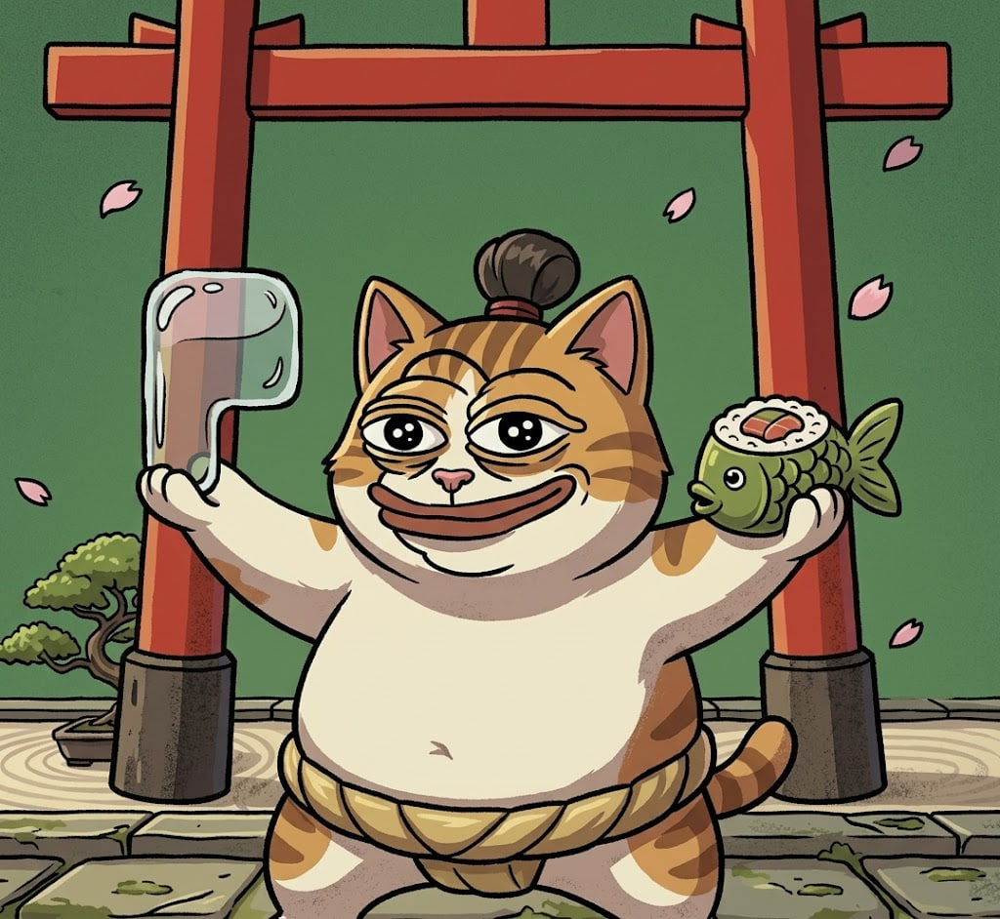

# $PONSHIMI - 0x0fb133f107fc5a3f3f94983c2a65b9b9d5f3092c
### The Weight Nobody Moves
**Brand Narrative and Technical Launch Reference for the Pons Family V2 Mascot**

---
 
## Who Ponshimi Is

Ponshimi is a round tabby cat dressed as a rikishi: gold mawashi knotted at the waist, chonmage tied above a heavy-lidded stare. He was never the fastest wrestler on the dohyo. He was the one nobody could push out of the circle.

That's the point. Pons Family is a protocol that never custodies user funds, routes fees back to creators, buys back its own token, and burns supply instead of hoarding it. Ponshimi exists because that resistance to displacement needed a face: something that holds its ground under pressure rather than something that grabs and runs.

He's not a static logo. He walks the platform's own documentation, appearing at every stage of the developer path through the GitHub repo, the way a senior rikishi walks a junior one through the stable.

---

## Part I — The World of Ponshimi

### Origin

Ponshimi wasn't born a champion. He was born heavy: too heavy to be shoved, too still to be baited. In the old counting-house tournaments, where the rules changed depending on who wrote them, he never had to cheat, sprint, or hide. He planted himself in the center of the ring and let the rigged system lose its own balance.

When he won his first real bout, he didn't pocket the prize. He tipped it out in front of everyone at ringside, the way kensho envelopes are thrown after a bout: public, unmediated, nobody's cut skimmed off first.

### The Dohyo as Protocol

The dohyo isn't scenery here, it's the chain itself. A tournament is a bonding curve: entry at the lowest rank, the banzuke, climbing division by division as more competitors join and the tournament fills, until a wrestler crosses the torii into what Ponshimi calls Promotion, his word for graduation, a permanent top-division ring no single opponent can wall off again.

The old custodial counting houses are his antagonists not for cruelty but for opacity. Open against walled, grounded against manipulable, shared against hoarded, that's the whole contrast the mythology runs on.

### The Sakazuki and the Salt

Ponshimi always carries two things, and keeps neither. A sakazuki, a sake cup, poured out and shared with anyone at ringside. A handful of shiomaki, purification salt, thrown to the clay before every bout and never picked back up.

Together they're the protocol's fee split made literal. The sakazuki, poured and re-shared, is the buyback: value returned to open circulation instead of sitting in one hand. The salt, thrown once and gone, is the burn: supply removed from the ring permanently, so no one can quietly stockpile it. Ponshimi's grip never closes on either. He lets both go, every time, where everyone can see.

### Voice and Temperament

Ponshimi isn't a brawler and isn't a clown. He's unhurried, dry, rarely surprised. He doesn't announce that he outlasted a market in freefall, he just stays standing while it happens around him. In copy and social voice: understated, never shouted, jokes aimed at the old walls, never at the audience.

---

## Part II — The Foundation: Pons Family V2

### What Pons Family Is

Pons Family is a launchpad built on Robinhood Chain. Anyone can deploy a fixed-supply token in minutes, no code required. A new token doesn't drop straight into an open market: it first trades on a bonding curve, price rising as more people buy in, until it reaches a graduation target. Liquidity then locks permanently and moves into a Uniswap V4 pool.

Two principles anchor everything else:

- **Non-custodial by design.** The platform never holds user funds. Every launch and every trade is a wallet-signed transaction, executed by the user, not on their behalf.
- **Fixed supply, visible rules.** Nothing mints after deployment. What exists at launch is what exists forever.

### What Changed in V2

- **ETH-based bonding curve.** Tokens price against ETH rather than a proprietary pair, simplifying pricing and bootstrapping liquidity.
- **Uniswap V4 integration at graduation.** Liquidity migrates directly into V4 infrastructure instead of a closed pool.
- **Expanded trading pairs, including tokenized stocks.** V2 approved tokenized equities as launch pairs, placing Pons at the intersection of meme culture and real-world asset tokenization.
- **Creator-aligned economics.** Creators are paid in the launch pair. A share of launch fees funds PONS buybacks; transaction fees are burned, permanently reducing supply.

### Contract-Level Mechanics

- `createToken(name, symbol, pair, metadataURI)` deploys a fixed-supply ERC-20 with a bonding curve contract; the creator selects ETH, an approved stablecoin, or an approved tokenized stock as the settlement pair.
- `buy(amount, minTokensOut)` / `sell(amount, minPairOut)` execute directly against the curve. Price moves algorithmically; no order book, no external market maker.
- A `graduationThreshold`, set per pair at deployment, makes the contract eligible to graduate once cumulative volume or reserve value crosses it.
- `graduate()` is permissionless. It migrates curve liquidity into a new Uniswap V4 pool, locks the LP position at protocol level, and disables further curve trading.
- A protocol fee on every buy/sell splits three ways: creator payout in the launch pair, funding for a scheduled PONS buyback, and a burn to a dead address, which has already removed a meaningful share of total PONS supply from circulation.

### Selecting a Stock as a Launch Pair

Tokenized stock pairing is allowlist-only. A creator selects from a maintained list of supported tokenized equities on Robinhood Chain at `createToken`. The curve is denominated in that stock, so price discovery and graduation thresholds are expressed in units of it, and at graduation, liquidity migrates into a Uniswap V4 pool against that same stock, carrying the original pair through to the token's permanent market. This is what connects meme culture to real-world assets without anyone leaving the Pons interface.

None of this is inherently visual. Bonding curves, graduation thresholds, fee splits and burns are contract logic. Users don't feel a contract execute, they feel a character behave the way that contract behaves. Closing that gap is the job of the design decisions below.

---

## Part III — Why a Cat, Why Sumo

| Protocol Mechanic | Ponshimi Trait | The Translation |
|---|---|---|
| Non-custodial, wallet-signed transactions | A wrestler who wins on his own weight, never on another's behalf | A rikishi never touches his opponent's stake; he wins by holding ground. Ponshimi never handles a wallet directly, he stands still and lets the user push. |
| Fixed supply, no post-launch minting | A weight class fixed before the bout begins | A rikishi's mass is what it is once he steps onto the dohyo; it doesn't grow mid-match. A round cat reads as already-complete, never as accumulating. |
| Fee split into buyback and burn | The Sakazuki (poured cup) and the Shiomaki (thrown salt) | One shared cup is value re-entering circulation; one handful of unrecovered salt is supply leaving it. Two gestures, one fee cycle, made legible without a chart. |
| Bonding curve and graduation | The banzuke climb toward Promotion | Sumo already runs on a public, verifiable rank ladder from lowest tier to top division, a direct map for a token's path from curve to graduation. |
| Permissionless deployment, stock pairing | A dohyo that answers only to weight held inside the circle | Pedigree doesn't matter in sumo, only who's still standing. The archetype of the immovable competitor needs no explanation, the audience already carries it. |

### Why a cat, and not a bear, a tanuki, or a human wrestler

Bulk without menace: a bear or elephant reads as force, a round cat reads as unbothered stability, "you cannot move me" rather than "I will flatten you." The wide, low silhouette signals resistance to displacement, the inverse of a lean, fast form. Here slowness is the asset, not the deficiency, because the story is about withstanding a push, not outrunning one.

The cat carries a second layer for free: in Japan, cats already read as fortune and shared prosperity, the maneki-neko welcoming custom rather than hoarding it. That folds Ponshimi's stability into a small ritual of luck at the door, not just a wrestling pose.

Cat coins are the most saturated category in crypto. The sumo frame, the torii, the sakazuki, the shiomaki, is what separates Ponshimi from a generic cat with a caption. Strip the ritual scaffolding and it's just another cat; keep it, and it's a character with physics of its own, not just an aesthetic.

---

## Part IV — Constructing the Launch

**1. Anchor to one mechanical truth.** Before naming or drawing anything: Ponshimi has to read as "you cannot move me" at a glance, zero copy required. Every later decision was tested against that line.

**2. Lock the visual system before the story.** Silhouette, palette, posture, first: a low, wide form, a tied gold mawashi, a heavy unbothered gaze, warm earth tones against torii red and green rather than neon crypto-mascot color. Only once the silhouette held at thumbnail size did backstory begin.

**3. Write the lore after the mechanics.** Origin, the dohyo-as-protocol frame, and the sakazuki/shiomaki device were reverse-engineered from the V2 contract logic into ritual, not the other way around. That order kept the myth accountable to the product.

**4. Stress-test against category saturation.** Cat coins are the most crowded lane in crypto; the sumo and shrine framing, and a still rather than dynamic default posture, were designed specifically to keep Ponshimi from dissolving into that noise.

**5. Design for stillness, not a static portrait.** Because the product's core claim is holding ground under pressure, never displaced, never custodying, Ponshimi's signature motion is a single shiko, the ritual foot-stomp before a bout, used for loading states, transaction confirmations, and short social loops. A mascot for stability still has to move memorably.

**6. Lock the recurring devices.** The Sakazuki (buyback), the Shiomaki (burn), the Torii (graduation threshold), and a posture switch between Hands-at-Rest and Shiko-in-Motion, signaling idle/permissionless versus active/executing. These four became permanent, reusable assets.

**7. Launch quiet, let the community write the myth.** No long explainer thread. A looping shiko, a single sakura petal crossing the torii. The gaps were deliberate, and community captions and fan art did more narrative work in week one than any official copy.

**8. Keep mechanic and myth moving together.** Every protocol change is a story beat, not a changelog line. A new pair is a new tournament. A fee adjustment changes how much salt is thrown or sake poured that cycle.

---

## Part V — Ponshimi on GitHub

Ponshimi accompanies the technical documentation itself, appearing at each stage of the developer path through the repository, from setup to graduation, as a consistent guide rather than a decorative header.

Each major section, setup, `createToken`, curve mechanics, pair selection, graduation, fee routing, gets a matched illustration using the same grammar locked in Part IV: resting posture at setup, the shiko at a trade, the torii crossing at graduation, the sakazuki and shiomaki beside the fee and burn explanation.

His documentation voice matches his brand voice: dry, unhurried, never burying technical complexity under a joke, never explaining it flat and faceless either. A developer reading the contract reference and a trader scrolling social should recognize the same character doing the same conceptual job.

---

## Closing Note

Ponshimi wasn't designed to be liked first. He was designed to be unmovable at a glance, and likability followed, the way it does with the best mascots. He doesn't explain the bonding curve. He's the bonding curve, sitting at the center of the ring, cup in one hand, a lucky fish in the other.

---

*Prepared as a brand narrative and technical launch reference for the Pons Family creative, community, and developer relations teams.*
